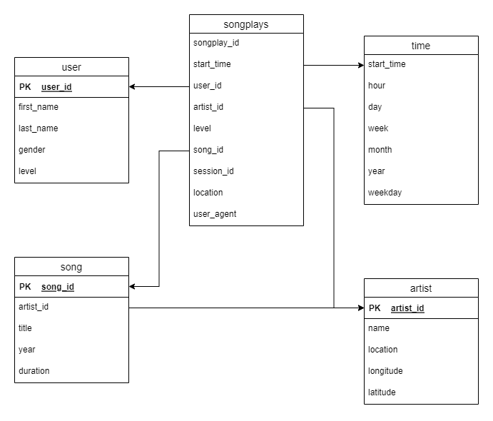

# Our objective in a nutshell
We have some data scattered around in JSON files. We want to reorganise and store it in a relational database.

## What is ETL?
ETL stands for (Extract, Transform, and Load). The essence is 
* We have a datasource (in our case the JSON files), from which we want to *extract* the data **(*Extract*)**
* We can then do some preprocessing (this can be doing calculations, or changing the format of some data, ...) **(*Transform*)**
* Then, we load the data into some destination (in our case, the postgres Database) **(*Load*)**

<div align = center></div>


## How will we do it?
Using python, we can 
* Read the JSON files (Extract)
* Do our preprocessing (Transform)
* Interact with the database, using a database driver directly, like (psycopg2), or using a driver, with an object relational Model (ORM) like sqlalchemy
<div align = center> </div>


## What's our data about?
Our data is a simulation of a music streaming app. The JSON files are split into two directores,
* One directory `song_data` holds json files about our songs, like the song title, the artist, ...
* The other directory `log_data` holds json files about Which songs were played, by whom, and at what time instances.

This can be shown in the following image:
<div align = center></div>


## Relational Database Schema
There are many schemas that can satisfy these requirements. In this project we will settle with a star-schema to make the queries less demanding in terms of performing joins, but at the cost of normalization, and the possibility of update anomalies. 

Designing the schema is outside the scope of this project, but if you want to learn more, you would need to study (database normalisation, denormalization and the pros and cons of different approaches towards schema design, such as star schema, snowflake schema, and others). 

So, our tables will can look like this
<div align = center> </div>

Where,
* `user` table holds info about the user `(Dimension Table)`
* `song` table holds info about the songs `(Dimension Table)`
* `artist` table holds info about the artist `(Dimension Table)`
* `time` table just expands info about the timestamp (which hour, day, week, month and year it belongs to) `(Dimension Table)`
* `songplay` table logs information whenever a song is played, so it's a `Fact Table`

## Which data from which source
* The JSON files concerned with `song data` will be used to fill the `song` and `artist` tables
* The JSON files concerned with `log data` will be used to fill the `user`, `time` and `songplay` tables

# File Structure
```
├── config.json
├── data
│   ├── cleaned
│   └── raw
├── images
├── requirements.txt
├── src
│   ├── extract_transform_notebook.ipynb
│   ├── create_tables.py
│   ├── etl.py
│   ├── extract_transform.py
│   ├── load_pg.py
│   ├── loading_notebook.ipynb
│   ├── sql_queries.py
│   └── test.ipynb
└── structure.txt
```
### The `data` Folder
The Data folder has 2 subcategories,
* `raw` folder, which contains the raw data for `song_files` and `log_files` as `JSON` files
* `cleaned` folder which containes the data after extraction and transformation (preprocessing) as `csv` files

### The `src` Folder
Our source code.
* `sql_queries.py` contains all our SQL queries that we will use for creating/dropping tables, and inserting data.
* `create_tables.py` is like the reset script. It drops the tables if they exist, and creates fresh empty tables.
* `extract_transform_notebook.ipynb` is a notebook in which we extract the data from the JSON files, investigate and transform it to make it cleaner, and save it to the `cleaned` data directory.
* `extract_transform.py` is the script version of the previous notebook
* `loading_notebook.ipynb` is a notebook in which we try to insert data into our tables, and see if we will face any issues.
* `load_pg.py` is the script version of loading the data into the Postgres Database

### The `config.json` file
* This file contains the credentials and configuration data to connect to a postgres Database.
* I put it in a separate file to make it easier to change the connection settings in one place without having to change it within the code.

Obviously, you will have to change this file's contents to run it on your machine, or connect to a remote Postgres database server

### The `requirements.txt` file
It lists the python version I used in this project, as well as the packages and their versions.

This makes it easier to install the needed packages directly, and (hopefully) without worrying much about package version mismatch.

